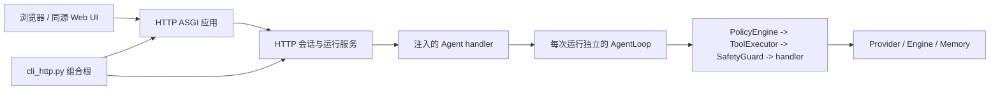
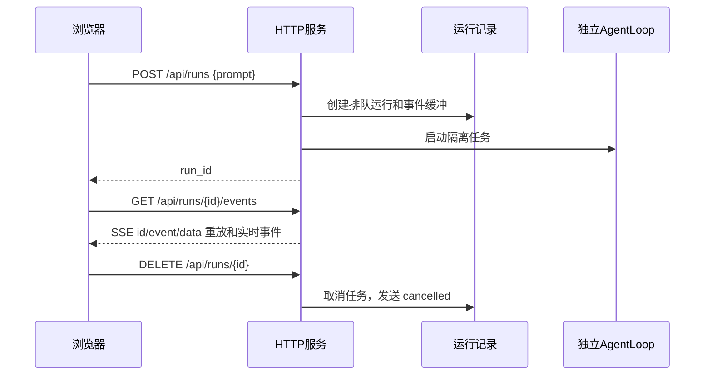

# 架构脊柱 - Epic 49 HTTP 网页访问

## 设计范式

Epic 49 采用分层传输与依赖注入架构。HTTP 层负责请求/响应分帧、浏览器安全响应头、静态资源、订阅和服务生命周期。CLI 入口是组合根：它构造既有的 Provider、Engine 和 Memory 组件，并注入 HTTP 运行服务。HTTP 传输层绝不构造或导入 AgentLoop、Provider、Engine、ToolRegistry 或 MCP 客户端。



## 继承的不变量

| 继承项 | 来源 | 在此处约束 |
| --- | --- | --- |
| 网络层仅负责传输 | Epic 48 架构 | `network/http_server.py` 负责 HTTP 协议和生命周期，而非构造 Agent。 |
| 注入 handler | Epic 48 架构 | HTTP 服务必须在构造时接收 agent/run service 或 handler。 |
| 默认回环绑定 | Epic 48 架构 | 默认绑定 `127.0.0.1`；非回环绑定属于显式实验性暴露，必须警告。 |
| 无认证/TLS 不构成安全边界 | Epic 48 架构 | HTTP MVP 默认仅限本地使用，绝不宣称远程使用安全。 |
| 既有治理链是权威 | 项目 `docs/frame.md` | Agent 工具执行仍为 `PolicyEngine.evaluate()` -> `ToolExecutor` -> `SafetyGuard.check()` -> handler。 |

## 不变量与规则

### AD-1 - HTTP 传输层独立于 Agent 组合 [ADOPTED]

- **Binds（约束）：** FR2、FR3、FR6、NFR1、NFR2、NFR10；`network/http_server.py`、HTTP 协议模型、ASGI 应用。
- **Prevents（防止）：** 传输模块构造 Provider、导入 CLI 装配、绕过 Engine 治理，或演变为第二套 Agent 运行时。
- **Rule（规则）：** network HTTP 层只能依赖 HTTP 协议模型、标准 asyncio/运行时设施、选定的 ASGI 框架、注入的服务协议、`network.exposure` 和 `safe_logging`。禁止在其中导入 Provider、AgentLoop、Engine、ToolRegistry、MCP 和 CLI。

### AD-2 - API 与打包 UI 使用同一个同源 ASGI 应用 [ADOPTED]

- **Binds（约束）：** FR3、FR4、FR6、UX-DR1 至 UX-DR6。
- **Prevents（防止）：** UI/API 漂移、仅依赖 CORS 的部署假设，以及只能在开发目录中工作的静态页面。
- **Rule（规则）：** 根路由通过包资源 API 提供 `src/heagent/web` 中的资源；`/api/*` 挂载在同一应用中。wheel 必须包含这些资源，任何运行时路径均不得依赖仓库检出目录。

### AD-3 - 运行状态由单一 HTTP 服务所有，并隔离每次运行 [ADOPTED]

- **Binds（约束）：** FR5、FR6、FR8、FR9、NFR4、NFR8；Story 49-2 至 49-4。
- **Prevents（防止）：** 多个所有者修改会话状态、跨运行泄露 prompt/结果，以及并发复用可变的 AgentLoop 展示状态。
- **Rule（规则）：** 一个进程只拥有一个内存内单用户会话。该服务拥有运行记录、运行任务、事件缓冲、订阅，以及将终态结果投影到会话快照的唯一 reducer。每次运行构造独立的 AgentLoop；MVP 同时只允许一个运行在途。成功完成的运行在最终记录冻结后，原子地投影其用户 prompt 和最终回答；失败、取消和超时的运行绝不将部分文本投影进历史。模型与用量仅从该运行复制到其终态记录。

### AD-4 - 将 SSE 视为可重放的只读订阅 [ADOPTED]

- **Binds（约束）：** FR4、FR7、FR9、NFR8；Story 49-3 和 49-4。
- **Prevents（防止）：** 断线取消 Agent 工作、事件所有权重复，以及浏览器重连时的静默缺口。
- **Rule（规则）：** SSE 消费者绝不拥有或取消运行任务。事件 ID 从 `1` 开始；`Last-Event-ID: N` 只重放严格大于 `N` 的 ID。每个终态事件在运行记录被淘汰前都保留在其运行缓冲中。活动流重放完终态事件后立即关闭。早于 `oldest_id - 1` 的游标返回 HTTP `409` 和 JSON 错误码 `resync_required`，绝不返回 SSE 成功流。活动流每 15 秒发送一次 SSE 注释心跳，不占用事件 ID。

### AD-5 - 生命周期失败必须显式且有界 [ADOPTED]

- **Binds（约束）：** FR1、FR2、FR8、NFR2、NFR3、NFR8、NFR9；Story 49-1 和 49-2。
- **Prevents（防止）：** 虚假的“正在监听”启动状态、listener 泄漏、无界关停挂起，以及默认 CLI 模式中静默降级 HTTP。
- **Rule（规则）：** `cli_http.py` 是唯一的生命周期所有者。仅当 listener 已可服务 `/api/health` 时，`start()` 才算完成；此后默认 CLI 工作流或显式命令才可公布 URL。`serve()` 在其所属的后台任务中运行，并将意外失败传播给该所有者。正常退出或 Ctrl+C 时，按以下顺序执行：停止接收新请求、使每个活动运行进入终态、发送其最终事件、关闭 SSE 流、关闭 listener，最后对残留任务最多等待 `HTTP_SHUTDOWN_TIMEOUT`。绑定/配置错误必须使调用命令失败，且绝不打印监听成功消息。

### AD-6 - HTTP 边界保持本地且以失败安全为准 [ADOPTED]

- **Binds（约束）：** NFR5、NFR6、NFR7、NFR9、NFR10；Story 49-5。
- **Prevents（防止）：** 意外远程暴露被误认为已认证服务、宽松的浏览器跨域请求，以及无界的输入/资源消耗。
- **Rule（规则）：** 默认绑定 `127.0.0.1:8766`。复用 `network.exposure` 产生非回环警告。将配置的 listener host 和 port 规范化为唯一 authority；每个请求的 Host 必须在 ASCII 大小写折叠和默认端口规范化后与其相等。任何 API 请求中若存在 Origin，必须等于 `http://` 加该 authority；缺少 Origin 的状态变更请求，仅在通过 Host 校验后才允许作为非浏览器客户端请求处理；拒绝 `Origin: null`、不匹配的 Origin、重复 Host 以及所有 forwarded-host 头。不得启用宽泛 CORS。应用 CSP/nosniff/禁止 framing 响应头，限制 request/prompt/连接/事件/运行/关停资源，并返回有界、脱敏的错误，不得携带 traceback、密钥、路径、prompt 或回答。

### AD-7 - 保持既有 Agent 治理链 [ADOPTED]

- **Binds（约束）：** FR4、FR8、NFR1、NFR10；Story 49-2 和 49-3。
- **Prevents（防止）：** HTTP 专用工具执行、MCP 自动连接、stdin 审批旁路，或弱于 CLI/TCP 的安全路径。
- **Rule（规则）：** 注入的 Agent handler 必须使用既有 AgentLoop 和 Engine 路径。工具调用仍为 `PolicyEngine.evaluate()` -> `ToolExecutor` -> `SafetyGuard.check()` -> handler。HTTP 绝不从请求体接收 provider、system、model、工具策略、sandbox、迭代或审批配置。

### AD-8 - 使用有类型的稳定 API 信封和显式限制 [ADOPTED]

- **Binds（约束）：** FR6、FR7、FR8、FR9、NFR2、NFR3。
- **Prevents（防止）：** 裸字典、不一致的浏览器错误、超大请求和无界并发工作。
- **Rule（规则）：** 跨模块 HTTP 请求、响应、运行记录和事件使用 Pydantic 模型。API 失败使用 `{ "error": { "code": ..., "message": ... } }`；限制由 Pydantic settings 校验，CLI 覆盖仅影响当前服务实例。

### AD-9 - 可观测性保持可诊断但不暴露内容 [ADOPTED]

- **Binds（约束）：** FR8、NFR6、NFR7；Story 49-5。
- **Prevents（防止）：** prompt、回答、凭据或内部路径通过请求/运行日志泄漏。
- **Rule（规则）：** 每条请求和运行日志携带不透明 request/run ID、状态、错误类别和耗时。日志失败不得改变协议行为。内容字段必须排除，或使用既有安全日志工具清洗。

### AD-10 - 每次终态转换只解析一次 [ADOPTED]

- **Binds（约束）：** FR4、FR8、FR9、NFR8；Story 49-4。
- **Prevents（防止）：** DELETE、超时、完成或关停竞争产生重复终态事件、泄漏在途许可或矛盾的会话状态。
- **Rule（规则）：** 运行服务串行化终态转换。完成、显式 DELETE、请求超时和关停都会请求转换；第一个取得运行记录的转换获胜，且仅发送 `done`、`cancelled`、`timed_out` 或 `error` 中的一个。获胜者冻结记录，在 `finally` 中释放在途槽位，并使后续转换请求成为 no-op。关停赢得的任何运行均使用 `cancelled`。

### AD-11 - 直接声明 HTTP 依赖和资源预算 [ADOPTED]

- **Binds（约束）：** FR2、FR3、FR8、NFR2、NFR3、NFR8、NFR9；Story 49-1、49-4 和 49-6。
- **Prevents（防止）：** 依赖 MCP 的传递 ASGI 包、依赖环境的限制，以及 wheel 安装中遗漏浏览器资源。
- **Rule（规则）：** `pyproject.toml` 直接声明包含兼容 Starlette 和 Uvicorn 约束的 `http` extra；HTTP 命令路径延迟导入这些包，缺失时给出安装诊断。`importlib.resources.files("heagent.web")` 是唯一的静态资源查找方式。HTTP 默认值为 `HTTP_HOST=127.0.0.1`、`HTTP_PORT=8766`、`HTTP_MAX_CONNECTIONS=16`、`HTTP_MAX_INFLIGHT_RUNS=1`、`HTTP_MAX_REQUEST_BYTES=65536`、`HTTP_EVENT_BUFFER_SIZE=512`、`HTTP_RUN_HISTORY_SIZE=64`、`HTTP_REQUEST_TIMEOUT=300` 和 `HTTP_SHUTDOWN_TIMEOUT=5`；字节值单位为 bytes，超时值单位为秒。Pydantic 校验全部值并拒绝非正限制。wheel 验收测试必须安装已构建的 wheel，并验证根路径、健康检查和包资源加载。

## 一致性约定

| 关注点 | 约定 |
| --- | --- |
| 命名 | HTTP 模块使用 `http_*`；路由使用小写 `/api/...`；ID 为不透明字符串；事件使用稳定的小写类型名。 |
| 数据与格式 | Pydantic 模型跨模块边界；JSON API 响应使用 UTF-8；SSE 使用 `id`、`event` 和 `data`；错误使用稳定的 `code` 和有界的人类可读消息。 |
| 状态与变更 | 一个 HTTP 服务拥有会话/运行状态及终态到会话的 reducer；运行任务是 Agent 执行的唯一所有者；SSE 只读；第一个终态转换获胜；取消必须显式使用 `DELETE`。 |
| 配置 | `HTTP_*` settings 使用 AD-11 默认值和 Pydantic 限制；CLI 覆盖是短暂的。 |
| 安全 | 同源 authority 为配置的 listener；不启用宽泛 CORS 或信任 forwarded 头；响应包含 CSP、`nosniff` 和禁止 framing；回环仅是暴露指导，不是认证。 |
| 测试 | 传输测试使用 fake service；集成测试使用 StubProvider；仅使用本地回环/ASGI；断言 wheel 资源；交付前执行完整 lint/format/mypy 回归。 |

## Stack（技术栈）

| 名称 | 版本 |
| --- | --- |
| Python | >=3.11 |
| Starlette | >=1.3.1,<1.4（直接声明的 `http` extra） |
| Uvicorn | >=0.50.1,<0.51（直接声明的 `http` extra） |
| Pydantic | 2.13.x（项目约束） |
| asyncio | Python 标准库 |

Starlette 和 Uvicorn 是直接在 `http` extra 中声明的可选 HTTP 依赖。缺失时，HTTP 命令必须给出明确的安装诊断；导入基础包或运行非 HTTP CLI 命令不得启动或要求 HTTP 服务。

## 结构种子

```text
src/heagent/
  network/
    http_protocol.py   # 有类型的 API/运行/事件/错误模型及请求校验
    http_server.py     # ASGI 路由、安全响应头、静态资源、生命周期
    exposure.py        # 共享的回环/非回环暴露判定
  cli_http.py          # Click 命令和组合根；注入 Agent 服务
  web/                 # 打包的 HTML/CSS/JS、同源和纯文本渲染
  agent/ engine/ providers/ memory/  # 既有运行时层，不因传输层改变
tests/
  network/test_http_server.py
  test_cli_http.py
  test_http_integration.py
  test_http_web_ui.py
```



```mermaid
flowchart TD
  CLI[heagent / heagent http-server] --> Config[HTTP settings 和 CLI 覆盖]
  Config --> App[ASGI 应用]
  App --> Health[/api/health]
  App --> Session[/api/session]
  App --> Runs[/api/runs]
  App --> Events[/api/runs/{run_id}/events SSE]
  App --> Cancel[DELETE /api/runs/{run_id}]
  App --> Static[/ 打包 Web UI]
  App --> Shutdown[有界 close/drain]
```

## 能力到架构映射

| 能力 / 范围 | 所在位置 | 受其约束 |
| --- | --- | --- |
| FR1/FR2 显式与自动服务生命周期 | `cli_http.py`、CLI 生命周期适配器 | AD-5、配置约定 |
| FR3 打包的同源 Web UI | `src/heagent/web`、ASGI 静态路由 | AD-2、AD-6 |
| FR4/FR7 流式传输和重连 | HTTP 运行服务、SSE 路由、环形缓冲 | AD-3、AD-4、AD-8 |
| FR5 单用户会话和刷新快照 | HTTP 服务会话投影 | AD-3 |
| FR6 健康/会话/运行/取消 API | `http_protocol.py`、`http_server.py` | AD-1、AD-8 |
| FR8 限制和稳定错误 | HTTP settings、中间件、服务 | AD-5、AD-6、AD-8 |
| FR9 取消和关停 | 运行任务所有者和生命周期控制器 | AD-3、AD-5 |
| FR10 既有治理和无 MCP/审批旁路 | CLI 组合根中注入的 Agent handler | AD-1、AD-7 |
| NFR4/NFR8 运行隔离和任务释放 | HTTP 服务生命周期、终态 reducer、SSE 所有者 | AD-3、AD-4、AD-5、AD-10 |
| NFR 可观测性和安全 | HTTP 中间件与安全日志 | AD-6、AD-9 |
| wheel/安装和 HTTP 依赖契约 | `pyproject.toml`、包资源、HTTP CLI 加载器 | AD-2、AD-11 |

## 延后决策

- 通过 `SessionStore` 或 `RunStore` 持久化 HTTP 会话/运行历史；MVP 有意在进程重启时丢失内存状态，仅当刷新/恢复需求扩展到一个进程之外时再重新评估。
- 远程/LAN 部署、认证、TLS、已认证用户的 CSRF 策略、多用户隔离和反向代理支持；这些需要独立的安全设计，绝不能从 `--host` 推导。
- WebSocket、文件上传、语音、provider/model 选择、工具审批 UI、MCP 管理和配置编辑；Epic 49 MVP 均不需要。
- 更丰富的事件总线或跨进程重放存储；进程内有界环形缓冲和 64 条运行记录历史足以满足 MVP，但不提供持久化投递保证。
