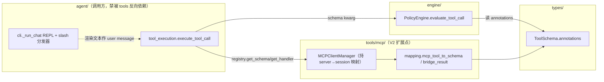

# Architecture Spine — HeAgent MCP Client V2（写操作治理 + Resources/Prompts）

> 本 spine 只承重「V2 引入的、未来 builder 无法从合规代码读出的不变量」。既有 HeAgent
> 架构（DAG / 执行链 / Provider 容错 / memory 闭环）权威见 `docs/frame.md`；V1 MCP 适配层
> 决策见 `_bmad-output/mcp-client/architecture.md`——本 spine **继承而非重述**两者。

## Design Paradigm

**brownfield 扩展（在既有扩展点上加固 + 接入，非新机制）**。V2 不引入新执行路径，落点是：

1. **给 V1 既有 `call_tool` 路径加一道确定性治理闸门**——把 MCP `Tool.annotations` 透传进 `ToolSchema`，由既有 `PolicyEngine` 消费（destructive 审批 / readOnly 放行 / 缺省 fail-safe）。判定在代码层、不在 LLM 层。
2. **把 Resources/Prompts 两原语以最小侵入接入既有循环**——Resources 走与 MCP 工具同构的「manager 注册桥接工具」路径；Prompts 走 CLI 一个新 slash 分发器。两者返回内容复用 V1 `bridge_result` 注入启发式围栏。

承重约束：**确定性逻辑交给代码、不交给概率模型**（项目硬约束）——「这个调用危不危险」由 `PolicyEngine` 纯函数裁决给出，单测可证（FR-A6）。

## Inherited Invariants

| Inherited | From parent | Binds here |
| --- | --- | --- |
| 工具执行链固定为 `PolicyEngine.evaluate() → ToolExecutor → SafetyGuard.check() → handler` | baseline `docs/frame.md` + CLAUDE.md | V2 治理闸门加在 evaluate 内部，**不改链路顺序**；Resources/Prompts 仍落到 `handler`/消息循环 |
| `tools/mcp/` 禁从 `agent/` 导入（DAG） | baseline + V1 architecture | 新增桥接代码仍只向 `types`/`exceptions`/`registry`/`mapping` 依赖；slash 分发器在 `cli.py`（`agent` 的调用方），不反向依赖 |
| 跨模块数据用 Pydantic `BaseModel` | baseline 代码规范 | `ToolSchema.annotations` 为 HeAgent 自有 Pydantic 模型，**不上浮 `mcp` 依赖进 `types.py`** |
| DP-4 围栏（执行前工具名黑名单 + 返回内容注入启发式）非真正安全边界 | V1 DP-4 + CLAUDE.md 安全声明 | Resources/Prompts 返回内容同等不可信，须 OS 级沙箱兜底——立场不变 |
| V1 MCP 工具经 `mcp_tool_to_schema` 映射 + `bridge_result` 桥接 + `_make_handler` 闭包注册 | V1 architecture FR-4/5/6 | V2 annotations 透传落在 `mcp_tool_to_schema`；Resources 桥接复用 `bridge_result` |

## Invariants & Rules



### AD-1 — annotations 经 ToolSchema 显式 kwarg 注入 PolicyEngine（OQ-2 定稿）

- **Binds:** FR-A1, FR-A2, FR-A3, FR-A4；`evaluate_tool_call` 签名
- **Prevents:** 三种接入方式各自引出的发散——污染 LLM 面向的 `ToolCall`、给无状态 `PolicyEngine` 注入随 server 连接/断连而变的 registry、把工具定义元数据错塞进 per-run 授权通道 `RunContext.metadata`
- **Rule:** `PolicyEngine.evaluate_tool_call(call, *, context=None, schema=None)` 增可选 kwarg `schema: ToolSchema | None = None`，读 `schema.annotations` 做裁决。调用方（`tool_execution.execute_tool_call`）在裁决前 `schema = loop.registry.get_schema(call.name)` 并传入——该处已用同一 registry 取 handler。两个 evaluate 调用点（正常路径 + ledger 缓存命中复核）都传 schema。`ToolCall`/`RunContext` 结构不变。

### AD-2 — 注解驱动的 fail-safe 审批裁决（策略优先级固定，fail-safe 仅 MCP）

- **Binds:** FR-A3, FR-A4, FR-A5, SM-1, SM-4, SM-C1
- **Prevents:** 两个 MCP 工具/服务对「是否需审批」判定不一致；fail-safe 沦为「无脑确认每个写操作」的吵闹版本（SM-C1 制衡）；**fail-safe 误伤 V1 内置工具**（缺 annotations 字段被当成「缺信号」强制审批 → 19 个内置工具全回归，SM-4 崩）
- **Rule:** `PolicyEngine` 在既有裁决的审批步内，按下列**固定优先级**（前者短路）判定 annotations：
  0. **前置闸门**：`schema=None`（V1 内置工具 / 未知工具，无 annotations）→ **跳过注解裁决**，回到既有路径（DIRECT / 既有 `approval_tools`·`sandbox_tools` 显式列表）。**fail-safe 仅作用于 MCP 工具**——内置工具零回归（SM-4）。
  1. 显式策略命中即 `APPROVAL_REQUIRED`——`approval_tools` 含该名 / `approval_mcp_tools` 开关且为 MCP 工具（**显式策略覆盖 annotation**，允许用户强制「全 MCP 需确认」盖过 server 的 readOnly 声明）；
  2. 否则（MCP 工具）`destructiveHint=true` → `APPROVAL_REQUIRED`；
  3. 否则（MCP 工具）`readOnlyHint=true` → 不审批（落 DIRECT / 既有沙箱裁决）；
  4. 否则（**MCP 工具**缺 annotations / 不可判定）→ `APPROVAL_REQUIRED`（fail-safe）。
  注解裁决触发的前提 = `_is_mcp_tool(call)` **且** `schema.annotations` 存在；二者任一不满足即走前置闸门回到既有行为，**绝不**对 V1 内置工具触发 fail-safe。`idempotentHint`/`openWorldHint` 透传存储、**不进裁决**（见 FR-A7）。授权语义沿用既有 `metadata.approved_tools`（含 `*` / MCP `__mcp__`）。

### AD-3 — 治理裁决确定性、纯函数化、可单测

- **Binds:** FR-A6, SM-5；项目硬约束「确定性逻辑交给代码」
- **Prevents:** 危险等级判定泄漏到 LLM 概率层（`ToolCall`/annotations/verdict 三者若经 LLM 中介则不可证、会漂移）
- **Rule:** annotations → `PolicyVerdict` 路径**不调用任何 LLM**：输入 `(ToolCall, annotations, context)` → 固定 `PolicyVerdict`。存在一个不触达 provider 的单元测试，构造 destructive / readOnly / 缺省三种 annotations 断言对应 verdict。

### AD-4 — MCPClientManager 持有 server→session 映射（B/C 前置）

- **Binds:** FR-B1, FR-B2, FR-C1；`MCPClientManager` 内部结构
- **Prevents:** Resources 桥接工具与 Prompts slash 命令各自独立「想办法够到 session」而发散——V1 session 仅存活于 `_server_loop` task 内、被 tool 闭包捕获、manager 不可达；**断连竞态**——`_sessions` 成 session 的第三个引用后，in-flight `read_resource` 与 `_unregister_server` 并发无定义错误语义（KeyError/None/挂死）
- **Rule:** `MCPClientManager` 增 `self._sessions: dict[str, ClientSession]`。`_server_loop` 在 `session.initialize()` 成功后把 session 登记进 `_sessions[normalized_name]`；`_unregister_server`（断连）与 `_unregister_all`（`__aexit__`）同步摘除。Resources/Prompts 桥接代码只经此映射取 session，**不再各自持有**。映射是 manager 的内部状态，不外泄给 `agent/`。
  **所有权与断连语义**：session 的唯一属主始终是其 `_server_loop` task（负责 enter/exit transport context）；`_sessions` 是**只读查找表**，非第二属主。断连/关停按 **flag-before-pop** 顺序：先把 server 标记为 stale（如 `_sessions` 移除该键），再让 transport context 退出；桥接调用观察到键已移除 → 抛**规范化 `ToolError("MCP server '%s' disconnected")`**（被 `_execute_one` 转 `is_error=True` 进 LLM 上下文，与既有 MCP 工具断连语义一致），**不得**裸抛 `KeyError`/`AttributeError`/None 访问。in-flight `call_tool`/`read_resource` 跨 task await 期间的断连由 SDK 抛错捕获转同一 `ToolError`。

### AD-5 — Resources 走「manager 注册的聚合桥接工具」路径（mcp__ 命名空间 + readOnly 自声明）

- **Binds:** FR-B1, FR-B2, FR-B3, FR-B4
- **Prevents:** 「Resources 算内置工具还是 MCP 桥接」归属发散；**桥接工具名无 `__` → `_is_mcp_tool` 不识别 → V1 MCP 门控（`block_mcp_tools`/`approval_mcp_tools`/`sandbox_mcp_tools`/`__mcp__` 授权）全部失效**（用户拉 MCP 总闸 `block_mcp_tools` 时 `read_resource` 仍可读 MCP server——安全语义缺口）；跨 server 同 URI 歧义
- **Rule:** `MCPClientManager` 在 **MCP 活跃时**注册两个聚合桥接工具（与 V1 MCP 工具同 `registry.register` 路径），闭包捕获 `self._sessions`：
  - **命名 = `mcp__` 聚合命名空间**：`mcp__list_resources` / `mcp__read_resource`（双下划线 → `_is_mcp_tool` 自动识别为 MCP 工具，**全量继承 V1 MCP 门控**：`block_mcp_tools` 拉闸即连 Resources 一起阻断、`approval_mcp_tools`/`sandbox_mcp_tools` 同理适用、`__mcp__` 授权生效）。非 `<server>__<tool>` 单 server 形态——`mcp` 作聚合 server token。
  - **自声明 `readOnlyHint=True`**（Resources 按 MCP 规范是 application-controlled、幂等无副作用的读）→ 默认不审批（落 AD-2 步 3 放行）；用户仍可 `approval_mcp_tools=True` 强制确认覆盖。
  - **LLM 可见签名钉死**：`list_resources()` → 返回 server-tagged 列表（每项 `{server, uri, name, description}`）；`read_resource(server: str, uri: str)` → 按 `(server, uri)` 取 `self._sessions[server]` 读。**`server` 参数必填**，消解跨 server 同 URI 歧义。**收紧 PRD FR-B2**（原写 `read_resource(uri=...)`，跨 server 聚合下 `uri` 单参歧义）→ 建议同步把 PRD FR-B2 Consequence 改为 `read_resource(server, uri)`，避免上游 PRD 与本 spine 静默漂移。
  - 无 MCP 配置时不注册（纯内置模式，与 V1 一致）。`read_resource` 返回文本经**公开的注入启发式围栏**（见 AD-6 fence 提升）标记后透传（DP-4 第二半，与工具返回同等不可信）。`read_resource` 指定 server 不在 `_sessions` / URI 不存在 → `ToolError`（显式失败）。PRD「内置工具」语义实为「LLM 可见工具」，此归属不冲突。[ASSUMPTION: server 不暴露资源 → `list_resources` 返回空列表、不抛错，对齐 FR-B1。]

### AD-6 — 三原语统一 on-demand + 同等不可信围栏（fence 提升为公共函数）

- **Binds:** FR-B3, FR-B4, FR-C4；R3 上下文侵蚀非回归
- **Prevents:** Resources 全量自动注入侵蚀上下文窗口（V1 已识别 R3 回归）；Tools/Resources/Prompts 返回内容信任边界不一致；**Prompts 围栏结构性缺失**——V1 注入围栏（`mapping._guard_injection`）是模块私有、仅由 `bridge_result` 在 MCP 工具闭包内调用，Prompts 经 `cli.py` slash → user message 完全旁路该路径（两 builder 会对「Prompts 是否围栏」做出不一致实现）
- **Rule:** (a) Resources **不**在会话启动自动注入——仅 `read_resource` 显式请求的 URI 进上下文；(b) Prompts 渲染文本作 user message 经既有 `run_stream` 进循环，**不**绕过消息管道；(c) **注入围栏提升为 `mapping.py` 公共函数**（如 `guard_content(text) -> str`，内部复用既有 `_scan_injection`/`_INJECTION_PATTERNS` 单一实现，不复制签名），`bridge_result` 改为对其文本结果调用同一函数；Tools（`bridge_result`）/ Resources（`mcp__read_resource`）/ Prompts（slash 分发器，见 AD-7）**三者一律调用同一公共围栏**，标记透传、不阻断、**同等不可信**。围栏非真正边界（见 AD-8）。

### AD-7 — Prompts 经最小 CLI slash 分发器（OQ-4 定稿）

- **Binds:** FR-C1, FR-C2, FR-C3
- **Prevents:** 为 Prompts 新造一条与既有消息循环并行的注入机制；**Prompts 渲染文本不经围栏直接进 user message**（注入缺口）
- **Rule:** `_run_chat` REPL 在 `input()` 与 `loop.run_stream()` 之间加最小 slash 分发器：`user_input.startswith("/")` → 查命令表分发；`/mcp-prompt <server> <name> [key=value ...]` 为首条命令，持 manager 引用调 `list_prompts`/`get_prompt`，渲染文本**先经公共围栏 `guard_content` 标记**（AD-6），再**作为 user message** 走 `run_stream`（复用既有循环，非旁路）。无既有 slash 机制可复用——此为新增薄表面。缺必填参数 / 模板不存在 → 显式错误（不静默空注入）。
  **结构变更（核实纠正）**：REPL 当前**并不持有 manager 引用**——`_mcp_lifecycle(settings)` 返回 ctx mgr，`_run_chat` 以 `async with mcp_ctx or contextlib.nullcontext():` 消费，manager 实例被包进 `async with` 不可达（原 AD-7 `[ASSUMPTION]` 引用的 `_build_mcp` 函数不存在，实为 `_mcp_lifecycle`）。故 `/mcp-prompt` 需 manager 暴露 prompts 能力——两条可选接入：(i) `_mcp_lifecycle` 返回 manager 并由 `_run_chat` 绑定变量（`mgr = _mcp_lifecycle(...)`）经 `as` 取实例进 REPL 作用域；(ii) manager 把 prompts 读取注册成与 Resources 同构的 `mcp__` 桥接工具，slash 分发器走 registry。**推荐 (i)**：与既有「外部 `async with` ctx mgr，AgentLoop 不动」V1 架构一致，改动最小、不把 prompts 塞进 LLM 工具列表（Prompts 是 user-controlled，本就不该 LLM 自主调）。

### AD-8 — 治理闸门 + 围栏均非真正安全边界（诚实立场）

- **Binds:** FR-A* feature NFR、SM-6、CLAUDE.md 安全声明
- **Prevents:** 制造「接了写操作 / annotations 治理就更安全」的假象
- **Rule:** `Tool.annotations` 是 server 自声明、不可信（恶意/错误 server 可把 `delete_repository` 谎报 `readOnlyHint=true`）；治理闸门与 DP-4 围栏同构，仅 defense-in-depth 标记。**须 OS 级沙箱兜底**。`CLAUDE.md` / `docs/frame.md` 安全声明须更新覆盖：写操作治理（annotation 不可信）+ Resources/Prompts 返回同等不可信。

## Consistency Conventions

| Concern | Convention |
| --- | --- |
| 命名（MCP 工具 / 桥接工具） | MCP 工具 `<server>__<tool>`（双下划线，`_is_mcp_tool` 依此判定，沿用 V1）；Resources 聚合桥接工具 `mcp__list_resources` / `mcp__read_resource`（`mcp` 作聚合 server token，**确保被识别为 MCP 工具**继承全量 V1 门控，见 AD-5） |
| 数据模型 | `ToolSchema.annotations` 为 HeAgent 自有 Pydantic 模型，字段覆盖四 hint（`readOnly`/`destructive`/`idempotent`/`openWorld`）；`mcp.types.ToolAnnotations` 实际还有第 5 个非决策字段 `title`——V2 **不透传 `title`**（非裁决信号，丢弃）。`annotations` 缺省本身不触发 fail-safe；fail-safe 仅在「MCP 工具 + 缺 annotations」时触发（AD-2 步 0/4），内置工具不受影响 |
| 错误语义 | Resources/Prompts 沿用 V1 `ToolError`（`read_resource` URI 不存在 / 缺必填参数 → 显式失败，不静默空返）；slash 命令错误回显到 REPL，不中断循环 |
| 围栏复用 | 三原语返回内容统一经 `mapping.bridge_result` 同等的注入启发式围栏（`_guard_injection`），命中加 warning 标记后透传——单一实现，不复制 |
| 日志 | 每模块 `logging.getLogger(__name__)`（stdlib）；annotation 触发审批 / 注入命中均记 WARNING（observable defense-in-depth） |
| 测试 | annotations→verdict 纯函数单测不触 provider；MCP 桥接用 stub session；每个测试 `reset_settings()`；零回归护栏覆盖既有 V1 MCP + 19 内置工具测试 |

## Stack

> SEED — 验证为 authoring 时现状；代码存在后归代码所有。V2 **不新增运行时依赖**——`mcp` SDK 已由 V1 引入。

| Name | Version |
| --- | --- |
| Python | 3.11+ |
| mcp（MCP Python SDK） | >=1.28,<2（installed 1.28.0；`ClientSession` 已暴露 `list_resources`/`read_resource`/`list_prompts`/`get_prompt`/`list_resource_templates`/`subscribe_resource`——本周期仅消费前四个） |
| Pydantic | v2（`ToolSchema.annotations` 自有模型） |
| click（CLI REPL + slash 分发器） | 既有 |

## Structural Seed

```text
src/heagent/
  types.py                       # +ToolSchema.annotations（自有 Pydantic 模型，四 hint）
  engine/policy.py               # evaluate_tool_call +schema kwarg；annotations 裁决步（AD-1/2/3）
  tools/mcp/
    mapping.py                   # mcp_tool_to_schema 透传 annotations；注入围栏提升为公共 guard_content（bridge_result/read_resource/slash 共用，AD-6）
    manager.py                   # +_sessions 映射（flag-before-pop）；+注册 mcp__list_resources/mcp__read_resource（readOnlyHint=True）；+prompts 读取入口（AD-4/5/7）
  agent/tool_execution.py        # evaluate 调用点传 schema kwarg（AD-1）—— 两处
  cli.py                         # +_run_chat slash 分发器 + /mcp-prompt（AD-7）
```

## Capability → Architecture Map

| Capability / FR | Lives in | Governed by |
| --- | --- | --- |
| FR-A1 ToolSchema 携带 annotations | `types.py` `ToolSchema` | AD-1（自有 Pydantic 模型，不上浮 mcp 依赖） |
| FR-A2 mapping 透传 annotations | `tools/mcp/mapping.py` `mcp_tool_to_schema` | AD-1（None→缺省保守标记） |
| FR-A3/A4/A5 注解→审批裁决（destructive/readOnly/fail-safe） | `engine/policy.py` `evaluate_tool_call` | AD-1（schema kwarg）+ AD-2（固定优先级）+ AD-3（确定性） |
| FR-A6 治理确定性可单测 | `tests/test_engine_*`（无 provider 单测） | AD-3 |
| FR-A7 idempotent/openWorld 暂存不裁决 | `types.py`（存储）+ `policy.py`（不消费） | AD-2 Rule 末 |
| FR-B1/B2 list_resources/read_resource | `tools/mcp/manager.py`（聚合桥接工具注册） | AD-4（session 映射）+ AD-5（manager 注册路径）+ AD-6（on-demand） |
| FR-B3 on-demand 不自动注入 | manager（不注入 system prompt） | AD-6(a) |
| FR-B4 返回同等不可信围栏 | `tools/mcp/mapping.py` `bridge_result` | AD-6(c) |
| FR-C1 list_prompts 发现 | `tools/mcp/manager.py`（经 `_sessions`） | AD-4 + AD-7 |
| FR-C2/C3 /mcp-prompt 渲染注入 + 参数化 | `cli.py` slash 分发器 | AD-7 |
| FR-C4 渲染输出同等不可信 | `tools/mcp/mapping.py` 注入围栏 | AD-6(c) |
| SM-6 安全声明更新 | `CLAUDE.md` / `docs/frame.md` | AD-8 |
| SM-4 零回归（既有 V1 MCP + 19 内置工具测试不退步，覆盖率不低于基线） | 全部新接入点的既有测试基线 + annotations/桥接工具新单测 | AD-2 步 0（fail-safe 不误伤内置工具）+ 整体 brownfield 不改执行链顺序 |

## Deferred

- **subscribe_resource（OQ-5）** — 与 FR-B3 on-demand（自动推资源更新进上下文 = R3 侵蚀）及 2026-07-28 stateless RC（订阅本质有状态）双冲突；revisit 条件 = stateless 迁移落定 + 出现真实 push 用例。
- **resource templates / `list_resource_templates`（OQ-6）** — 具名 resources 已覆盖主用例，模板需额外 URI 展开逻辑，边际价值低；revisit 条件 = 出现参数化 URI 模板的真实需求。
- **idempotentHint / openWorldHint 裁决消费（FR-A7）** — V2 仅透传存储，不据此改 verdict；revisit 条件 = 出现据「连外部世界」自动加沙箱等用例。
- **fail-safe 保守度增强（PRD OQ-1）** — 缺 annotations 全确认若实测太吵，V3 增「已知只读工具名白名单 / per-server 关闭 fail-safe」；本周期 fail-safe 已定稿。
- **用户可配置注入签名入口（DP-4 围栏硬化）** — 正交于本周期，独立 spec 跟踪；V2 仅内置启发式集。
- **内置（非 MCP）工具 annotation 驱动治理** — V2 仅 MCP 工具透传 annotations；内置工具危险分级仍由既有显式列表管。
- **完整操作/环境维度** — 部署 / infra / ops 非本 feature altitude 所辖（属 baseline `frame.md` 五），不在此裁决。
