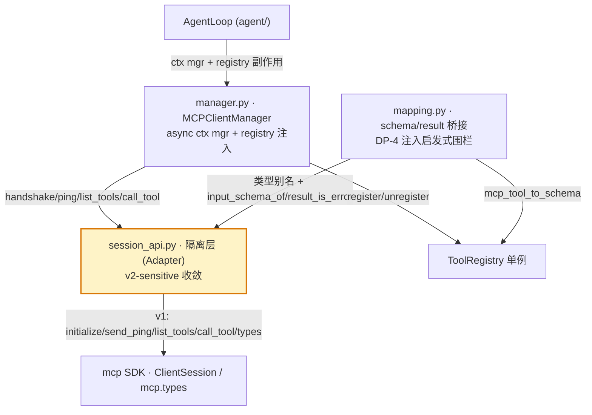

# Architecture Spine — HeAgent MCP v1→v2 升级准备

> Feature-altitude spine。不重述 `docs/frame.md` 已定的整体架构；只固定本周期（Epic 14+）引入的隔离层不变量，使 v2 stable 落地时切换局部化、Epic 11-13 零回归。技术事实源 = `addendum.md`（一手 research 2026-07-12）。

## Design Paradigm

**Anti-corruption layer（Adapter，函数式收敛模块）。** 在 `tools/mcp/` 与官方 `mcp` SDK 之间插一层 `session_api.py`，收敛全部 v2-sensitive 调用点；`manager.py` / `mapping.py` 不再直接触碰 SDK 的 session 方法或 `mcp.types`，改从隔离层取稳定函数 + 类型别名。SDK 演进（v1→v2 breaking）被层吸收，不波及上游。函数式而非 Protocol 类——v1→v2 是**替换**不是并存，多态无价值（见 AD-1 否决理由，memlog entry 11）。

## Inherited Invariants

继承自 `mcp-client` 周期（Epic 11-13）+ `docs/frame.md`，read-only，本 spine 不重导出：

| Inherited | From | Binds here |
| --- | --- | --- |
| mcp-client NFR-3（握手等封装在 MCPClientManager 内，为 stateless 迁移留接口） | `_bmad-output/mcp-client/prd.md` | 隔离层把已封装的握手扩展到全部 5 点——兑现而非重设 |
| mcp-client FR-3（运行时 ping-watch 断连 → auto-unregister，2026-07-01 落地） | mcp-client prd | v2 等价机制不可退化断连工具注销立场（AD-3） |
| mcp-client DP-4（执行前工具名拦截 + 返回内容启发式围栏） | mcp-client prd / CLAUDE.md 安全声明 | 隔离层不削弱 `mapping.bridge_result` 围栏，不引入新边界 |
| DAG：`tools/mcp/` 禁从 `agent/` 导入 | frame.md §三 / CLAUDE.md 硬约束 | 隔离层只依赖 types/exceptions/registry/config，不反向 |
| 异步：库代码无同步 I/O | CLAUDE.md | 隔离层全 async，无同步 SDK 调用 |
| Pydantic 模型跨模块，禁 raw dict | CLAUDE.md | 隔离层 passthrough SDK 原生类型，不新造模型（见 Conventions） |

## Invariants & Rules

### AD-1 — 隔离层收敛全部 v2-sensitive 调用点

- **Binds:** FR-2；manager.py / mapping.py 的 5 个命中点
- **Prevents:** `manager.py` / `mapping.py` 直接依赖 SDK API 形态，v2 breaking 冲刷散落多点（initialize 删除 / send_ping deprecated / list_tools 签名变 / call_tool 返回 snake_case / types 拆包）
- **Rule:** 新建 `tools/mcp/session_api.py`，导出下表稳定函数 + 类型别名。`manager.py` / `mapping.py` **禁止**直接 `session.initialize()` / `send_ping()` / `list_tools()` / `call_tool()` 或 `from mcp.types import ...`；必须经 `session_api`。5 点精确映射：

| 隔离层导出 | v1 实现（现源码位置） | v2 切换时改 |
| --- | --- | --- |
| `async handshake(session) -> None` | `await session.initialize()`（manager.py:215,226） | v2 见切换路径 open question（协议删握手；SDK 保留 legacy `initialize`） |
| `async ping(session, timeout) -> None` | `await session.send_ping()`（manager.py:290，`_watch`）；失败 raise | 占位 C → 切 A（见 AD-3） |
| `async list_tools(session) -> list[Tool]` | `await session.list_tools()`（manager.py:234） | `params=PaginatedRequestParams(cursor=)` + 返回 snake_case |
| `async call_tool(session, name, args) -> CallToolResult` | `await session.call_tool(name, args)`（manager.py:256） | 返回字段全 snake_case |
| 类型别名 `Tool`/`CallToolResult`/`TextContent`/`ImageContent`/`EmbeddedResource` | `from mcp.types import ...`（mapping.py:18） | `from mcp_types import ...`（拆独立包） |
| `input_schema_of(tool) -> dict` | `tool.inputSchema`（mapping.py:41） | `tool.input_schema` |
| `result_is_error(result) -> bool` | `result.isError`（mapping.py:132） | `result.is_error` |

> `call_result_to_text` 的 `isinstance(block, TextContent/...)` 分派经类型别名（v2 类型名不变，仅字段 camelCase→snake_case；`block.text` 不变），无需额外兼容函数。

### AD-2 — 隔离层对外接口 v1→v2 切换 diff 为空

- **Binds:** NFR-2 / FR-5；兑现 mcp-client NFR-3 成功标准
- **Prevents:** v2 切换波及 `manager.py` / `mapping.py` / `AgentLoop`
- **Rule:** `session_api.py` 导出函数签名在 v1→v2 切换前后保持不变（NFR-2 字面）。v2 切换改动**限于 `MCPClientManager` 内部**——`session_api.py` 内部实现 + `manager.py` 的 `_make_handler`/`_watch` 局部（A-path 失败回调，见 AD-3）；`mapping.py` 零改动；**不波及 `AgentLoop`**。兑现 mcp-client NFR-3 成功标准的真实边界（MCPClientManager 内部，非 session_api 单文件）。`MCPClientManager` 对 `AgentLoop` 的接口（async ctx mgr + `ToolRegistry` 副作用）本就不暴露 SDK 形态。

### AD-3 — FR-3 v2 等价机制 = C 过渡占位 + v2 切 A 被动

- **Binds:** FR-3 / mcp-client FR-3（安全立场）
- **Prevents:** v2 stateless 下 `send_ping` deprecated → 断连探测失效 → 工具滞留 LLM 列表（安全退化）
- **Rule:**
  - **本周期（v1）：** `session_api.ping()` 保留 `send_ping` 占位（候选 C，纯 v1，NFR-4）；`_watch` 周期探测**逻辑不动**，仅 `send_ping` 调用点改经 `session_api.ping()`（AD-1 收敛）。
  - **v2 切换时（文档化，不含本周期实现）：** `ping()` 语义改为**候选 A**——`_make_handler` 的 handler 闭包加 `try/except session_api.call_tool`，失败调 `_unregister_server(name)`（被动注销）。A 与 stateless 哲学一致（无持久 session 可断，每请求独立，失败即注销最自然）、零额外开销；"延迟发现"缺点在 stateless 下窗口语义已变（无持久连接可断）。
  - **异常范围：** `try/except` **只包 `session_api.call_tool`**，永不包 `bridge_result`——`isError` → `ToolError` 是正常工具错误语义（LLM 可见），不触发 server 注销（否则 AD-5 回归）。
  - **安全立场不可退化：** 无论 A/B，v2 形态下断连工具必须主动或被动注销，不得滞留。`_unregister_server` 复用且幂等（`pop(name, ())`），注销路径不变。

### AD-4 — 纯 v1 准备边界

- **Binds:** NFR-4 / FR-5
- **Prevents:** 引入 v2 alpha 依赖、本周期交付依赖 v2 stable 时点（R3）
- **Rule:** `session_api.py` 在 v1 SDK（`mcp>=1.27.2,<2`）上实现，不 import v2-only API（`server/discover`、`mcp_types` 等）；v2 stable（目标 2026-07-27）落地前不执行切换。本周期交付不依赖 v2 时点。

### AD-5 — [ADOPTED] 零回归基线

- **Binds:** NFR-1 / FR-4
- **Prevents:** 隔离层重构破坏 Epic 11-13 MCP 集成（连接 / 发现 / 调用 / 断连探测四链）
- **Rule:** `tests/test_mcp_*.py`（含 mcp-client DP-4 用例）全绿为本周期所有改动的零回归上限。本周期**须为 `session_api.py` 新增单测**（`handshake`/`ping`/`list_tools`/`call_tool` 各 v1 实现 + `input_schema_of`/`result_is_error` 字段兼容），与既有测试共同构成切换前后零回归基线。`[ADOPTED]`——mcp-client 已交付测试基线，隔离层重构须保持其绿。
- **Prevents（补充）：** 新增 bug / 既有用例红 / 隔离层无单测（story 间测试范围分歧）。

### AD-6 — [ADOPTED] DAG + 异步 + 类型

- **Binds:** NFR-5
- **Prevents:** `tools/mcp/` 反向依赖 `agent/`；同步 I/O 进库；跨模块 raw dict
- **Rule:** 隔离层依赖 mcp SDK + 按需 `heagent.types`/`exceptions`；禁从 `agent` 导入，**禁从 `mapping` 导入**（`mapping` 反向从 `session_api` 取类型别名，单向防循环）；全 async；passthrough SDK 原生类型，不新造 Pydantic 模型。`[ADOPTED]`——frame.md / CLAUDE.md 硬约束已定。

## Consistency Conventions

| Concern | Convention |
| --- | --- |
| 命名 | 文件 `session_api.py`（snake_case）；函数 `handshake`/`ping`/`list_tools`/`call_tool`/`input_schema_of`/`result_is_error`（动词短语）；类型别名沿用 SDK 原名（`Tool`/`CallToolResult` 等），不加后缀 |
| 数据 | 隔离层 passthrough SDK 原生类型（`Tool`/`CallToolResult`），不引入新 Pydantic 模型（避免双重抽象）；字段访问经兼容函数（`input_schema_of`/`result_is_error`），不直接触 camelCase 字段 |
| 状态 | 隔离层无状态（纯函数 + 传入 `session`）；`session` 生命周期仍由 `MCPClientManager` 持有（per-server task，同 task enter/exit，避免 anyio cancel scope 跨 task——继承现有架构） |
| 日志 | `logging.getLogger(__name__)`，stdlib only；握手 / 健康探测 / 切换点有 INFO/WARNING（NFR-6 可观测） |
| 错误 | 沿用 `ToolError`（mapping `bridge_result`）；隔离层不吞异常，连接/发现失败隔离由 `MCPClientManager._server_loop` 既有 `except` 兜底 |

## Stack

| Name | Version |
| --- | --- |
| Python | 3.11+ |
| mcp（官方 SDK） | >=1.27.2,<2（FR-1 收紧，v1 线最新 stable 2026-05-29） |
| pytest + pytest-asyncio | auto 模式 |
| asyncio | stdlib |

## Structural Seed



> DAG 方向：`agent/` → `tools/mcp/` → `mcp SDK`（正向）。`tools/mcp/` 不反向依赖 `agent/`。隔离层（黄）是 `manager`/`mapping` 与 SDK 之间唯一的 v2-sensitive 接触面。

```text
src/heagent/tools/mcp/
  config.py        # MCPConfig + load_mcp_config（无 v2-sensitive，不动）
  session_api.py   # 【新增】隔离层：5 调用点收敛 + 类型别名 + 字段兼容
  manager.py       # MCPClientManager：改从 session_api 取（_transport_and_session/_watch/_discover_and_register/_make_handler）
  mapping.py       # mcp_tool_to_schema/bridge_result：改从 session_api 取类型 + 字段兼容
```

## Capability → Architecture Map

| Capability / Area | Lives in | Governed by |
| --- | --- | --- |
| FR-1 pin 收紧 | `pyproject.toml` + Stack | AD-4 |
| FR-2 隔离层封装 5 调用点 | `session_api.py` | AD-1 / AD-2 |
| FR-3 断连探测 v2 等价机制 | `session_api.ping()` + §v2 切换路径 | AD-3 / mcp-client FR-3 |
| FR-4 迁移测试基线 | `tests/test_mcp_*.py` | AD-5 |
| FR-5 切换路径文档化 | §v2 切换路径 | AD-2 / AD-4 |
| NFR-1 零回归 | `tests/test_mcp_*.py` | AD-5 |
| NFR-2 封装局部化 | `session_api.py` 对外签名 | AD-2 |
| NFR-3 DP-4 立场延续 | `mapping.bridge_result`（不动） | Inherited DP-4 |
| NFR-4 纯 v1 | `session_api.py` 无 v2 import | AD-4 |
| NFR-5 DAG/异步 | `session_api.py` 依赖方向 | AD-6 |
| NFR-6 可观测 | `session_api.py` 日志 | Conventions |

## v2 切换路径（FR-5 文档化，不含执行）

> 触发条件：v2 stable（目标 2026-07-27）落地。切换另开独立任务（可能跨周期），本周期只产出路径。

1. **`session_api.py` 内部改实现 + `manager.py` 局部**（限于 MCPClientManager 内部，不波及 AgentLoop，AD-2；`session_api` 对外签名 diff 为空）：
   - `handshake(session)` → 见 open question（协议删握手；SDK v2 保留 `ClientSession.initialize()` 为 legacy——或仍调 legacy initialize 保留 ClientSession，或 no-op 迁 `Client(mode='auto')`）
   - `ping(session, timeout)` → 候选 A 语义（call_tool 失败触发注销，见步骤 3）
   - `list_tools(session)` → `params=PaginatedRequestParams(cursor=)` + 返回 snake_case
   - `call_tool(session, name, args)` → 返回 `CallToolResult` 字段全 snake_case
   - 类型别名 → `from mcp_types import ...`
   - `input_schema_of` → `tool.input_schema`；`result_is_error` → `result.is_error`
2. **`manager.py` 局部改 + `mapping.py` 零改动**（AD-2：`_make_handler` 加 A-path 失败回调 + `_watch` 经 `session_api.ping`；`mapping.py` git diff 为空）。
3. **FR-3 等价机制实现（A）：** `_watch` 从周期 `ping` 改为 `call_tool` 失败回调注销——`_make_handler` 的 handler 闭包捕获 call_tool 异常 → 调 `_unregister_server(name)`。注销路径（`_unregister_server`）复用，不新增。复核：v2 形态下断连工具仍注销（AD-3 安全立场）。
4. **测试：** `tests/test_mcp_*.py` 全绿（AD-5）；新增 v2 断连探测用例（A 语义）。
5. **备选 B（重评条件）：** 若 v2 stable 后 A 的延迟发现在实测中造成工具滞留窗口不可接受，且 `server/discover` 已稳定，重评切 B（周期 ping 改 `server/discover` 探活）。本周期否决 B（memlog entry 12），但不锁死未来。

**Open question（留 v2 stable 落地时切换任务定，本周期纯 v1 不决）：** v2 切换时是否迁移 `ClientSession`→`Client(mode='auto')`？
- 保留 `ClientSession`（仍调 legacy `initialize()`）：`_transport_and_session` 不动，AD-2 最稳，但未真正 stateless。
- 迁 `Client(mode='auto')`：`_transport_and_session` 改构造 `Client`（`manager.py` 局部，AD-2 允许），handshake 真 no-op，但 `mode='auto'` 探 `server/discover` 回退 `initialize` 的运行时行为需验证。

## Deferred

- **v2 实际切换执行**：v2 stable 落地后另开任务，可能跨周期（R3：若跳票，本周期 v1 隔离层交付仍有效）。
- **FR-3 等价机制实现（A）**：本周期只文档化选型 + 路径，不含实现（NFR-4 纯 v1）。
- **Resources / Prompts / 写操作**：原 mcp-primitives 方向暂挂，v2 stable 后重评（addendum §4 生态依据）。
- **`server/discover` 主动探测（B）**：本周期否决，留作 A 实测不足时的备选（见切换路径步骤 5）。
- **隔离层是否升级为 Protocol**：若 v2 形态显示需要 v1/v2 并存（如灰度切换），重评 AD-1 形态；当前 v1→v2 替换非并存，函数式收敛足够（R1）。
- **用户可配置注入签名入口**：mcp-client DP-4 deferred 项，与本周期正交，不消费。
